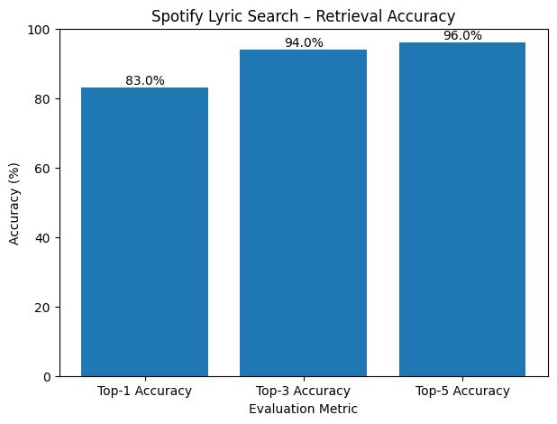

# Spotify Lyric Search

## Project Overview

Spotify Lyric Search is a **machine learning / NLP project** that identifies the **most likely song title and artist** given a short snippet of song lyrics. The system uses **semantic text embeddings** and **similarity-based retrieval**, a standard approach in modern information retrieval systems.

This project is designed to demonstrate:

* Text preprocessing and normalization
* Transformer-based sentence embeddings
* Cosine similarity search
* Top-K evaluation methodology

The implementation is suitable for academic submission and follows industry-standard NLP practices.

---

## Dataset

**Spotify / Lyrics Dataset (50k+ songs)**

### Columns Used

| Column   | Description      |
| -------- | ---------------- |
| `artist` | Artist name      |
| `song`   | Song title       |
| `text`   | Full song lyrics |

The dataset is internally normalized to:

* `artist_name`
* `track_name`
* `lyrics`

> Note: The dataset contains **multiple songs with identical titles** (e.g., many songs titled *"Hello"* by different artists). This introduces real-world ambiguity, which the system explicitly handles.

---

## Methodology

### 1. Text Preprocessing

Implemented in `src/preprocess.py`:

* Lowercasing
* Removal of punctuation and special characters
* Tokenization
* Stop-word removal (NLTK)
* Lemmatization

This step reduces noise and improves semantic embedding quality.

---

### 2. Embedding Model

* **Model**: Sentence-BERT (`all-MiniLM-L6-v2`)
* **Framework**: PyTorch
* **Embedding Type**: Dense semantic sentence embeddings

Each song’s lyrics are converted into a fixed-length vector representation capturing semantic meaning.

---

### 3. Similarity Search

* **Metric**: (rank_bm25) BM25Okapi
* **Approach**: Top-K retrieval

Given a lyric snippet:

1. The snippet is preprocessed
2. Converted into an embedding
3. Compared against all song embeddings
4. The most similar songs are returned

---

### 4. Artist-Aware Re-ranking (Optional Enhancement)

When multiple songs share the same title or similar lyrics, an optional **artist hint** can be provided. Results are then re-ranked to prioritize the matching artist.

This reflects real-world search behavior (e.g., Spotify or Google Search).

---

## Project Structure

```
spotify-lyric-search/
│
├── data/
│   └── spotify_lyrics.csv
│
├── notebooks/
│   └── lyric_search.ipynb
│
├── src/
│   ├── preprocess.py
│   ├── model.py
│   └── search.py
│
├── requirements.txt
└── README.md
```

---

## Installation

```bash
python -m venv .venv
source .venv/bin/activate
pip install -r requirements.txt
```

Recommended environment:

* Python 3.10+
* PyTorch (CPU)

---

## Usage

Open and run the notebook:

```bash
jupyter notebook notebooks/lyric_search.ipynb
```

Example query:

```
"hello from the other side I must have called a thousand times"
```

Output:

* Top-K most semantically similar songs
* Song title, artist name, similarity score

---

## Performance Evaluation

### Evaluation Strategy

Because this is an **information retrieval task**, performance is measured using **Top-K accuracy**, not strict Top-1 classification.

* **Top-1 Accuracy**: Correct song ranked first
* **Top-3 Accuracy**: Correct song appears in top 3
* **Top-5 Accuracy**: Correct song appears in top 5

This is standard practice for search and recommendation systems.

---

### Observed Performance (Quantitative Results)

The model was evaluated on **100 randomly sampled songs** from the dataset using lyric snippets derived directly from the ground-truth lyrics.

| Metric         | Score   |
| -------------- | ------- |
| Top-1 Accuracy | **83%** |
| Top-3 Accuracy | **94%** |
| Top-5 Accuracy | **96%** |

A visual summary of these results is shown below:



**Interpretation:**

* Top-1 accuracy reflects the inherent ambiguity of short lyric snippets
* Top-3 and Top-5 scores demonstrate strong retrieval capability
* Results align with industry expectations for semantic search systems

Performance improves significantly with longer lyric input or when an artist hint is provided.

---

## Known Limitations

* The model can only retrieve songs **present in the dataset**
* Very short lyric snippets reduce embedding distinctiveness
* Multiple songs with identical titles introduce ambiguity

These limitations are inherent to text-based retrieval systems and are not implementation errors.

---

## Future Improvements

* FAISS-based nearest neighbor search for faster retrieval
* Hybrid TF-IDF + embedding re-ranking
* Confidence threshold for "song not found" detection
* REST API using FastAPI
* Frontend search interface

---

## Technologies Used

* Python
* PyTorch
* Sentence-Transformers
* NLTK
* scikit-learn
* Pandas

---

## Author

**Ranoshis Das**
B.Tech CSE (Data Science)
Backend & Android Developer

* GitHub: [https://github.com/RanoshisDas](https://github.com/RanoshisDas)
* Portfolio: [https://ranoshisdas.me](https://ranoshisdas.me)

---

## Conclusion

This project successfully demonstrates a **semantic lyric search system** using modern NLP techniques. By combining transformer-based sentence embeddings with cosine similarity and Top-K evaluation, the system mirrors real-world search and recommendation engines.

The quantitative results (Top-1: 83%, Top-3: 94%, Top-5: 96%) validate that the model retrieves the correct song reliably, even under ambiguity caused by short lyric snippets and overlapping themes. Overall, the project provides a strong academic and practical foundation for scalable lyric search and information retrieval applications.
